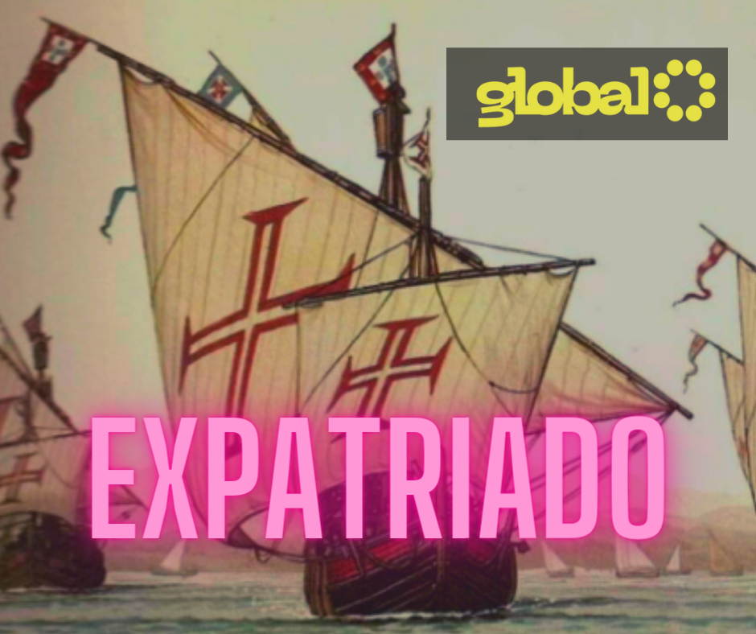

<!-- PROJECT SHIELDS -->

[![Contributors][contributors-shield]][contributors-url]
[![Forks][forks-shield]][forks-url]
[![Stargazers][stars-shield]][stars-url]
[![Issues][issues-shield]][issues-url]
[![MIT License][license-shield]][license-url]
[![LinkedIn][linkedin-shield]][linkedin-url]

<!-- PROJECT LOGO -->

# Masterclass_Portugal

## Projeto para masterclass Overview Portugal

Este repositorio destina-se a armazenar os topicos, material de apoio e detalhes sobre a Masterclass Portugal

# Programa Nivel 1

## 02 - Projeto Portugal ( 15 minutos )

Um resumo sobre estudo, vida, trabalho, transporte, viagens, riscos e custos.

### 02.1 - Planejamento ( 5 minutos )

Orçamento, planos, pesquisas, aspirações e contatos.

### 02.2 - Realização ( 5 minutos )

Os primeiros dias, onde ficar, o que fazer, dificuldades e soluções.

### 02.3 - A Realidade ( 5 minutos )

Acompanhamento financeiros, problemas cambiais, problemas de envios e recebimentos, senhas e cartoes

---

 [Menu Masterclass](00_Masterclass.MD)

---

#### * DIO - Digital Inovation One *
######  [Inscreva-se na Dio](https://web.dio.me/sign-up?ref=R5J3ZLTIFS)  

######  [Vagner Bellacosa perfil na Dio](https://web.dio.me/users/vagnerbellacosa?tab=achievements)  

<!-- MARKDOWN LINKS & IMAGES -->
<!-- https://www.markdownguide.org/basic-syntax/#reference-style-links -->
[contributors-shield]: https://img.shields.io/github/contributors/VagnerBellacosa/Masterclass_Portugal.svg?style=for-the-badge
[contributors-url]: https://github.com/VagnerBellacosa/Masterclass_Portugal/graphs/contributors
[forks-shield]: https://img.shields.io/github/forks/VagnerBellacosa/Masterclass_Portugal.svg?style=for-the-badge
[forks-url]: https://github.com/VagnerBellacosa/Masterclass_Portugal/network/members
[stars-shield]: https://img.shields.io/github/stars/VagnerBellacosa/Masterclass_Portugal.svg?style=for-the-badge
[stars-url]: https://github.com/VagnerBellacosa/Masterclass_Portugal/stargazers
[issues-shield]: https://img.shields.io/github/issues/VagnerBellacosa/Masterclass_Portugal.svg?style=for-the-badge
[issues-url]: https://github.com/VagnerBellacosa/Masterclass_Portugal/issues
[license-shield]: https://img.shields.io/github/license/VagnerBellacosa/Masterclass_Portugal.svg?style=for-the-badge
[license-url]: https://github.com/VagnerBellacosa/Masterclass_Portugal/blob/master/LICENSE.txt
[linkedin-shield]: https://img.shields.io/badge/-LinkedIn-black.svg?style=for-the-badge&logo=linkedin&colorB=555
[linkedin-url]: https://www.linkedin.com/in/VagnerBellacosa/
[product-screenshot]: Images/Descoberta.png
