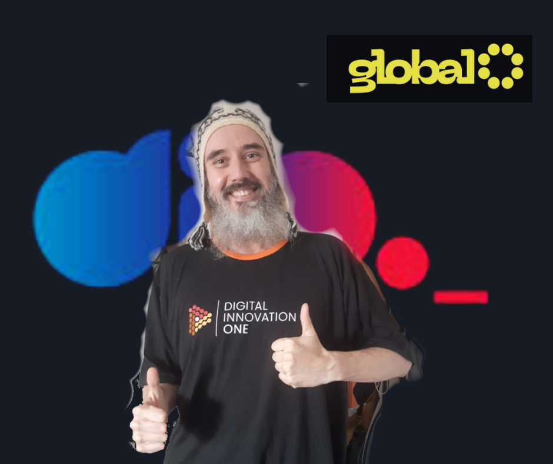

<!-- PROJECT SHIELDS -->

[![Contributors][contributors-shield]][contributors-url]
[![Forks][forks-shield]][forks-url]
[![Stargazers][stars-shield]][stars-url]
[![Issues][issues-shield]][issues-url]
[![MIT License][license-shield]][license-url]
[![LinkedIn][linkedin-shield]][linkedin-url]

<!-- PROJECT LOGO -->

# Masterclass_Portugal

## Projeto para masterclass Overview Portugal

Este repositorio destina-se a armazenar os topicos, material de apoio e detalhes sobre a Masterclass Portugal 

# Programa Nivel 0 ( 120 minutos )

Salve #Dioners, padawans curiosos, #Dionitos em Ação e curiosos em Geral.

Seja muito bem-vindo para meu repositorio do Projeto DIO GLOBAL Masterclass, esta é a minha primeira inversão de papel, passando de um consumidor viciadão para o criador de conteúdos educacionais.

Este esboço é o que pretendo compartilhar com os parças, retribuindo o tanto de conhecimento que obtive na Digital Innovation One. Muito Obrigado #Dioners!!!

Este documento foi dividido em Modulos horizontais em nivel 0, 1 e 2. Qualquer duvida / anomalia / dubialidades, agradeço que abra uma ISSUE, rapidamente remendarei e você nem perceberá. 😁😁😁

Espero que goste e não esqueça da estrelinha, ajuda bastante na visibilidade do projeto.

- [Masterclass](00_Masterclass.MD)
  - [ToDo List](TodoList.MD)

---

#### * DIO - Digital Inovation One *
######  [Inscreva-se na Dio](https://web.dio.me/sign-up?ref=R5J3ZLTIFS)  

######  [Vagner Bellacosa perfil na Dio](https://web.dio.me/users/vagnerbellacosa?tab=achievements)  

<!-- MARKDOWN LINKS & IMAGES -->
<!-- https://www.markdownguide.org/basic-syntax/#reference-style-links -->
[contributors-shield]: https://img.shields.io/github/contributors/VagnerBellacosa/Masterclass_Portugal.svg?style=for-the-badge
[contributors-url]: https://github.com/VagnerBellacosa/Masterclass_Portugal/graphs/contributors
[forks-shield]: https://img.shields.io/github/forks/VagnerBellacosa/Masterclass_Portugal.svg?style=for-the-badge
[forks-url]: https://github.com/VagnerBellacosa/Masterclass_Portugal/network/members
[stars-shield]: https://img.shields.io/github/stars/VagnerBellacosa/Masterclass_Portugal.svg?style=for-the-badge
[stars-url]: https://github.com/VagnerBellacosa/Masterclass_Portugal/stargazers
[issues-shield]: https://img.shields.io/github/issues/VagnerBellacosa/Masterclass_Portugal.svg?style=for-the-badge
[issues-url]: https://github.com/VagnerBellacosa/Masterclass_Portugal/issues
[license-shield]: https://img.shields.io/github/license/VagnerBellacosa/Masterclass_Portugal.svg?style=for-the-badge
[license-url]: https://github.com/VagnerBellacosa/Masterclass_Portugal/blob/master/LICENSE.txt
[linkedin-shield]: https://img.shields.io/badge/-LinkedIn-black.svg?style=for-the-badge&logo=linkedin&colorB=555
[linkedin-url]: https://www.linkedin.com/in/VagnerBellacosa/
[product-screenshot]: Images/MenuPrincipal.png

